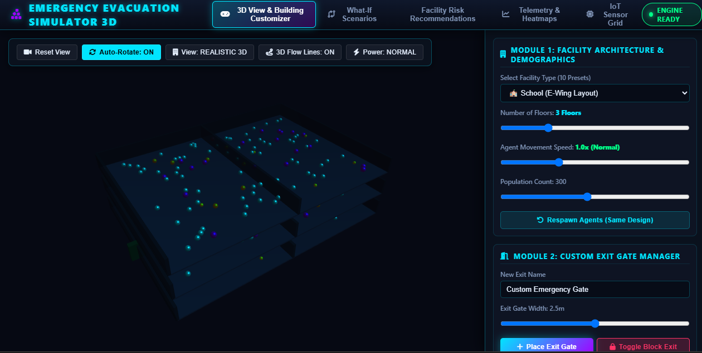
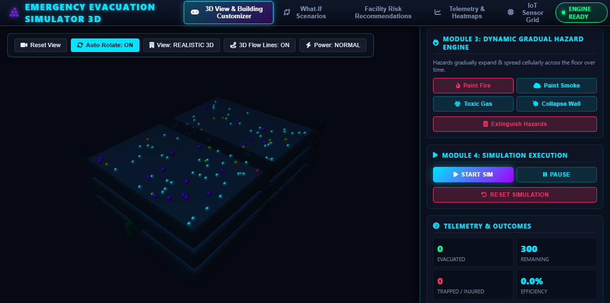
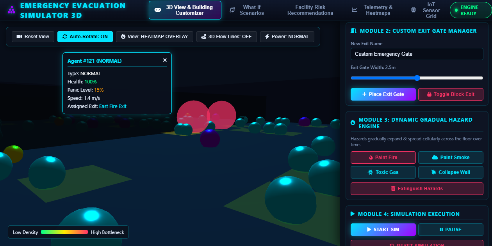
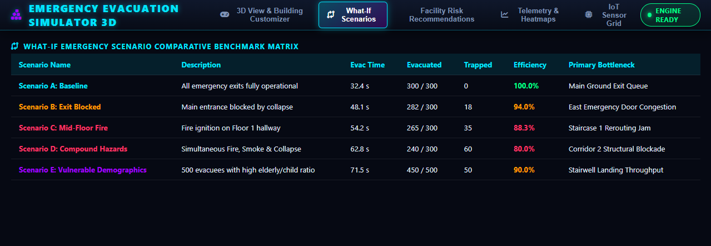
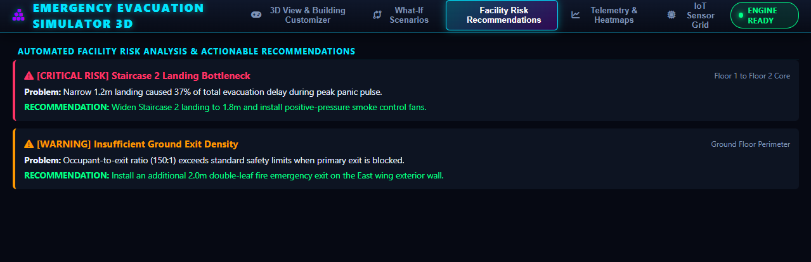
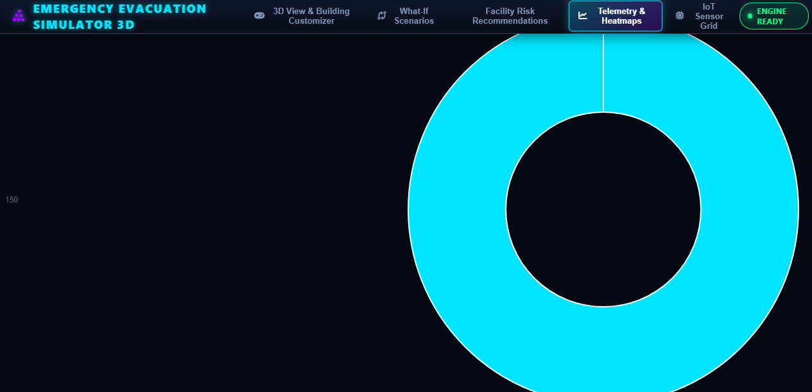
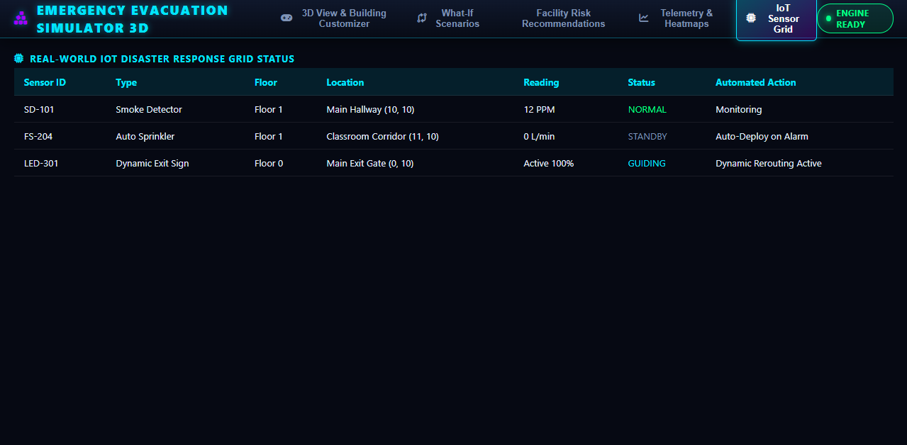

# Emergency Evacuation System

> **Real-World Multi-Floor Emergency Evacuation Simulation & Analytics Platform in Modern C++**

---

## Overview

**Emergency Evacuation System** is a C++-based emergency evacuation simulation and spatial telemetry platform rewritten from the Java Swing version into modern **C++17/20**.

The system provides multi-floor 3D spatial simulation, multi-hazard propagation, IoT sensor grid response, crowd dynamics using the Social Force Model, 3D A* pathfinding, and interactive telemetry dashboards.

---

## Key Features & Upgrades over Java Swing

| Feature              | Java Swing Version (v2.0) | Emergency Evacuation System - C++                                                            |
| -------------------- | ------------------------- | -------------------------------------------------------------------------------------------- |
| **Spatial Graphics** | 2D Grid Layout            | **Full 3D Multi-Floor Building Rendering** with Orbit Camera and Floor Slices                |
| **Building Support** | Single Floor              | **Multi-Story Buildings** with vertical Stairwell & Elevator transitions                     |
| **Pathfinding**      | 2D A*                     | **3D A* Algorithm** with crowd density penalties & hazard cost rerouting                     |
| **Agent Dynamics**   | Simple Grid Movement      | **Social Force Model** with repulsion, panic speeds, and smoke inhalation                    |
| **Hazard Models**    | Static 2D Tiles           | **Cellular Fire, Thermal Smoke Rise, Toxic Gas & Structural Collapse**                       |
| **Smart Systems**    | Manual Controls           | **IoT Sensor Grid** with Smoke Detectors, Automated Sprinklers, and Dynamic LED Exit Signs   |
| **User Interface**   | Single View Console       | **Futuristic 5-Tab Command Center** for Control, Architect, Telemetry, Sensors, and Settings |

---

## Project Architecture

```text
Emergency_Evac_Sys_Cpp/
├── CMakeLists.txt              # Build configuration for GCC / Clang / MSVC
├── README.md                   # System documentation & manual
├── include/
│   ├── Core/
│   │   ├── Vector3.hpp         # 3D spatial math vector
│   │   ├── Camera3D.hpp        # 3D Orbit camera controller
│   │   └── Logger.hpp          # Thread-safe system event logger
│   ├── Simulation/
│   │   ├── BuildingMap.hpp     # Multi-floor 3D spatial grid & presets
│   │   ├── Agent.hpp           # 3D Agent physics & social force model
│   │   ├── Pathfinding.hpp     # 3D A* vertical pathfinding algorithm
│   │   ├── HazardModel.hpp     # Multi-hazard cellular spread model
│   │   ├── SensorGrid.hpp      # Smart IoT disaster response system
│   │   └── EvacSimulationEngine.hpp # Master simulation controller
│   ├── Analytics/
│   │   ├── HeatmapGenerator.hpp # Crowd congestion & bottleneck heatmap generator
│   │   └── EvacMetrics.hpp      # Real-time evacuation curves & efficiency calculator
│   └── UI/
│       └── UIStyles.hpp         # Dark cyber styling & color constants
├── src/                        # Complete C++ implementations
│   ├── Core/
│   ├── Simulation/
│   ├── Analytics/
│   ├── UI/
│   └── main.cpp                # Native C++ entry point & CLI telemetry
├── scenarios/                  # Preset JSON scenarios
│   ├── school_multi_floor.json
│   ├── hospital_complex.json
│   └── highrise_office.json
├── Screenshots/                # Project screenshots
└── web_preview/
    └── index.html              # Standalone Interactive 3D Web Preview
```

---

## How to Run the 3D Interactive Web App (Instant Preview)

To immediately launch and test the interactive 3D simulation suite with orbit controls, tabs, and interactive hazard painting:

1. Open `web_preview/index.html` in any web browser such as Chrome, Edge, Firefox, or Safari.
2. Explore the 3D simulation environment:

   * **Rotate Camera:** Left-Click + Drag
   * **Pan:** Right-Click + Drag
   * **Zoom:** Mouse Scroll Wheel
   * **Filter Floors:** Click `Floor 1`, `Floor 2`, or `All Floors`
   * **Paint 3D Hazards:** Use `Paint Fire`, `Paint Smoke`, or `Toxic Gas`
   * **Start Evacuation:** Click `START SIM`
   * **Explore Tabs:** Command & Control, Building Architect, Telemetry & Heatmaps, IoT Sensor Grid, and Scenario Manager

---

## How to Compile & Run the Native C++ Engine

### Prerequisites

* Modern C++ Compiler (`g++`, `clang++`, or MSVC with C++17 support)
* `cmake` version 3.14 or higher

### Build Instructions

```bash
# 1. Navigate to the project directory
cd Emergency_Evac_Sys_Cpp

# 2. Create build directory
mkdir build && cd build

# 3. Configure with CMake
cmake ..

# 4. Compile the project
cmake --build .

# 5. Run the Emergency Evacuation System executable
./FuturaEvac3D
```

---

## Analytics & CSV Export

The engine continuously records:

* **Evacuation Throughput Curve**
* **Casualty & Smoke Inhalation Index**
* **System Efficiency Score (%)**
* **Bottleneck Congestion Heatmaps**

Telemetry data can be exported directly to standard CSV format via the Scenario Manager tab or C++ `metrics.exportToCSV()`.

---

## Screenshots

### 1. 3D View



### 2. 3D Simulation View



### 3. 3D Building View



### 4. What-If Scenarios



### 5. Risk Recommendations



### 6. Heatmaps



### 7. IoT Sensor Grid


